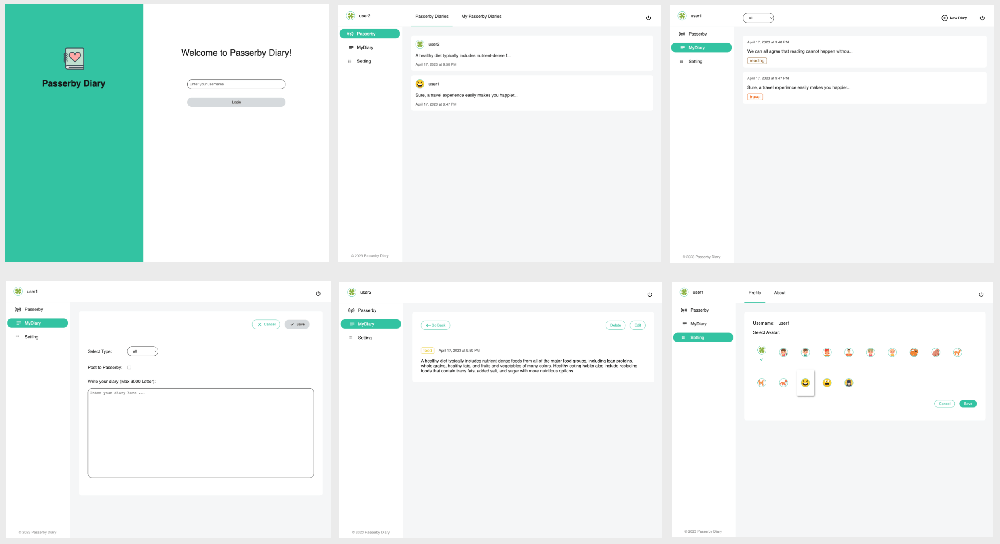

# Passerby Diary

## About The Project

Passerby Diary is a simple and sophisticated diary application that allows users to create and share their diaries. In addition, it has a "Passerby" section where users can post their diary, which are open to all users. However, passers-by can only view the passerby diaries, and they can't comment or connect with the diary owners. The app is designed to be a safe and private space for users to share their thoughts and experiences with others.

## Visuals

Thoughtstream is designed to be intuitive and user-friendly, with a simple and clean interface that makes it easy to navigate and use.

## Authors and acknowledgment

Author: Mengyun Xie
Date: Apr 17 2023

## License

[MIT](https://choosealicense.com/licenses/mit/)
